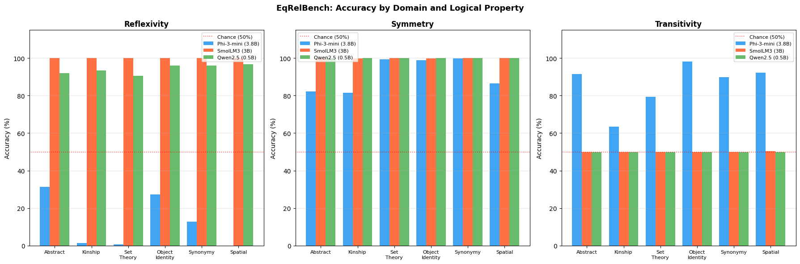
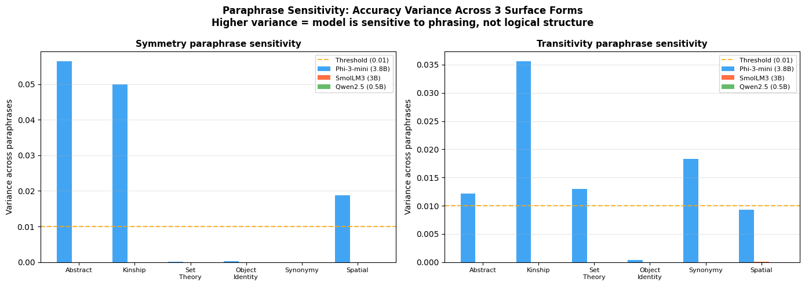
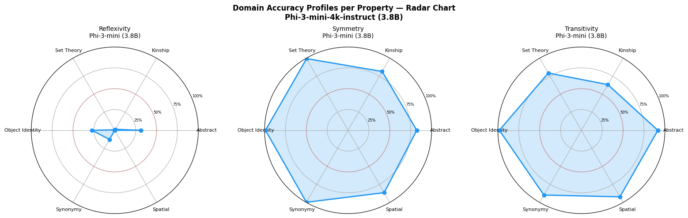

# EqRelBench Results

This document explains each result figure, what the numbers tell us, and how these findings connect to the goals of the ICLR 2026 Workshop on Logical Reasoning of Large Language Models.

The workshop calls for benchmarks that go beyond outcome-based accuracy, that resist shortcut learning, and that measure logical consistency across related questions. Our results speak directly to all three of these.

---

## Result 1: Accuracy by Domain and Logical Property

This bar chart tests three models (Phi-3-mini 3.8B, SmolLM3 3B, Qwen2.5 0.5B) on six domains (Abstract, Kinship, Set Theory, Object Identity, Synonymy, Spatial) across reflexivity, symmetry, and transitivity.

### Reflexivity (left panel)

Phi-3-mini scores very low everywhere. Abstract gets about 32%, Object Identity about 28%, Synonymy around 13%, and Kinship, Set Theory, and Spatial all sit at or near 0%. The model is asked "Does X equal X?" and it mostly says "no." Without an explicit premise handing it the answer, it treats this as a factual question about a random string it has never seen and defaults to rejection. This is a failure of deductive reasoning in the most basic sense: the model does not recognize that self-identity holds by definition regardless of what X is.

SmolLM3 and Qwen2.5 both score close to 100%. Before reading too much into that, note that both models have a yes-bias where they output "yes" to nearly everything. Since reflexivity labels are all "yes," a model that says "yes" every time gets perfect accuracy without doing any reasoning. This is exactly the kind of shortcut the workshop wants benchmarks to expose.

### Symmetry (middle panel)

Phi-3-mini gets around 61% on Abstract and 83% on Kinship. The other four semantic domains land between 87% and 100%. The gap between abstract and semantic domains matters. On Kinship or Synonymy, the model can lean on what it learned during pretraining about how "same age" or "synonymous with" works. It already knows these relations go both ways. On the Abstract domain, where entities are random strings like KFQZ and ABLM, there is no background knowledge to rely on. The model has to actually apply the symmetry rule from the premises alone, and it does noticeably worse.

SmolLM3 and Qwen2.5 are near 100% again, for the same reason as above.

### Transitivity (right panel)

Phi-3-mini gets about 64% on Abstract, 80% on Kinship, and near 100% on the rest. The abstract domain is the hardest because the model has to verify a chain of premises without any semantic shortcuts.

SmolLM3 and Qwen2.5 hover around 50%. Transitivity has a balanced 50/50 split of yes and no labels, so a model that always says "yes" gets the positives right and all the negatives wrong, landing at chance. This is a clean diagnostic: if your model scores 100% on reflexivity and symmetry but 50% on transitivity, it is not reasoning at all.

### Why this matters for the workshop

The workshop's Topic 5 calls for "next-generation benchmark design" that resists shortcut learning and distinguishes genuine reasoning from pattern matching. This figure demonstrates that EqRelBench does exactly that. It catches shortcut behavior in two ways: (1) the abstract vs. semantic domain gap reveals when a model is using domain knowledge instead of applying logical rules, and (2) the 100/100/50 pattern in smaller models immediately flags degenerate yes-bias. A standard accuracy-only evaluation would miss both of these.

The workshop also asks for "interpretable and fine-grained evaluation" that goes beyond outcome-based accuracy. Breaking results down by property and domain is a step in that direction. A single aggregate accuracy number for these models would hide everything interesting about how they fail.

---

## Result 2: Paraphrase Sensitivity

Each logical scenario is phrased in three different surface forms. This figure plots the variance in accuracy across those three phrasings. If the model is actually reasoning about the logical content, rephrasing should not change the answer. If it is matching surface patterns, rephrasing will cause its accuracy to swing.

### Symmetry paraphrase sensitivity (left panel)

Phi-3-mini has high variance on Abstract (about 0.075) and Kinship (about 0.05), both well above the 0.01 threshold. Set Theory, Object Identity, and Synonymy show near-zero variance. Spatial sits around 0.02.

The pattern makes sense. On domains where the model already has strong semantic priors (it knows set equality is symmetric, it knows identity is symmetric), rephrasing does not shake it. On Abstract and Kinship, where it has weaker priors or the phrasing changes alter surface-level cues the model was relying on, accuracy becomes unstable.

SmolLM3 and Qwen2.5 show zero variance everywhere. This is not robustness. A model that outputs the same token regardless of input will always have zero variance. It tells us nothing about reasoning stability.

### Transitivity paraphrase sensitivity (right panel)

Phi-3-mini shows variance above the threshold on Abstract (0.012), Kinship (0.036), Set Theory (0.014), and Synonymy (0.019). Object Identity and Spatial stay low. Kinship stands out. For transitivity questions phrased using kinship relations, small changes in wording cause big swings in whether the model gets the answer right. This suggests the model's accuracy on kinship transitivity is fragile and tied to surface form.

SmolLM3 and Qwen2.5 remain flat at zero. Same artifact.

### Why this matters for the workshop

This connects directly to Topic 3 of the workshop, which is about logical contradictions across related questions. Paraphrase variants are logically identical questions with different surface forms. When the model answers one variant correctly and another incorrectly, it is producing contradictory responses to the same logical content. The workshop description specifically mentions "identifying and resolving conflicts" and "ensuring long-range coherence" as open problems. Our paraphrase sensitivity results quantify how often these conflicts occur and on which domains they are worst.

It also ties to the workshop's interest in deduction enhancement. The fact that Phi-3-mini's deductive accuracy fluctuates with phrasing means it is not adhering to the underlying logical rule in a stable way. A model that truly applies the symmetry axiom would not care whether you write "If A equals B, does B equal A?" or "Given that A is the same as B, is B the same as A?" The variance measures exactly how far the model is from that ideal.

---

## Result 3: Domain Accuracy Radar Charts

Three radar charts show Phi-3-mini's accuracy across all six domains for each property. Each vertex of the hexagon is a domain, and the blue area shows accuracy reaching toward 100%.

### Reflexivity radar (left)

The blue area is collapsed near the center everywhere. No domain gets above about 32%. The model uniformly fails at self-identity. This is the simplest logical property we test and the model cannot handle it regardless of how the relation is framed.

### Symmetry radar (middle)

The hexagon is mostly full but has a visible dent at Abstract (61%) and a smaller dent at Kinship (83%). The remaining four domains are at or near 100%. The shape tells the story at a glance: wherever semantic knowledge is available, the model looks competent. Where it is not, accuracy drops.

### Transitivity radar (right)

Nearly the same shape as symmetry. Full hexagon except for Abstract (64%) and Kinship (80%). The consistency of this dent across both properties is important. It is not a one-off result. Abstract reasoning is reliably harder than semantically grounded reasoning, across both symmetry and transitivity.

### Why this matters for the workshop

The workshop description notes that LLMs "often fail to handle complex logical problems with multiple premises and constraints." The radar charts show this is not an all-or-nothing failure. Models can handle logical properties just fine when semantic knowledge provides a backdoor. The failure is specific to settings where the model has to reason from premises alone, which is what the abstract domain isolates.

This distinction matters for benchmark design. A benchmark that only uses semantically rich domains (kinship, spatial, etc.) would conclude that models handle symmetry and transitivity well. The abstract domain reveals that this competence is partly borrowed from pretraining knowledge rather than built from logical rules. The workshop calls for benchmarks "resistant to shortcut learning." Including an abstract domain alongside semantic ones is one concrete way to achieve that, because it strips away the shortcuts and forces the model to rely on structure.

---
